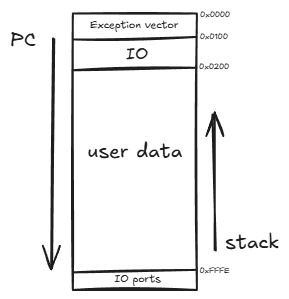

# ISA

| [Architecture](#1-architecture) | [Instructions](#2-instructions) | [Op Codes](#3-op-codes) | [Flags](#4-flags) |

## 1. Architecture



- 16-bit architecture
- 8 general purpose registers (R0-R7) 
> R0 is always 0 and cannot be written to
- 16-bit address space (64KB)
- Little-endian
- Stack grows downwards
- dedicated flags register with 4 flags: Zero (Z), Sign (S), Carry (C), Overflow (O)
- dedicated registers: PC (program counter), SP (stack pointer)

### 1.1 Memory Map

```
0x0000 - 0x00FF : Exception vectos
0x0100 - 0x01FF : Exception handlers (Firmware)
0x0200 - 0xFFEF : User mem (program + stack)
0xFFF0 - 0xFFFF : IO ports (kernel only)
```

### 1.2 System registers

```
EPC : saves PC on trap, restored on ERET
cause : saves cause code of trap
status : 0 kernel, 1 user
```

### 1.3 IO ports

```
0xFFF0 : UART data (R/W)
0xFFF4 : number IO (R/W)
```

## 2. Instructions

```
R  :  5 bit opcode, 3 bit reg a, 3 bit reg b, 3 bit reg c 2 option flags 
I  :  5 bit opcode, 3 bit reg a, 3 bit reg b, 5 bit imm
IL :  5 bit opcode, 3 bit reg a, 8 bit imm
J  :  5 bit opcode, 11 bit imm
```
### 2.1 Option bits

Option bits are used to change the behavior of operations.
```
(SHL, SHR)
00 : logical shift
01 : arithmetic shift

(DIV)
x0 : unsigned division
x1 : signed division
0x : flags from quotient
1x : flags from remainder
```
### 2.2 Instruction set

1. **R instructions**:
    - `ADD, SUB, AND, OR, XOR, SHL, SHR, MUL, NOT, NEG, DIV`
2. **I instructions**:
    - `ADDI, SUBI, LOAD, STORE`
    
3. **IL instructions**:
    - `LUI, ORI, CALL, JUMP, PUSH, POP, CMP, CMPI, ANDI, TST`

4. **J instructions**:
    - `SYSCALL, ERET, HALT, RET, JEQ, JNE, JLT, JGT`

### 2.3 Pseudo-instructions
```
NOP         ->    ADDI R0, R0, 0      ; writes to R0, silently ignored
MOV ra, rb  ->    ADD ra, R0, rb      ; ra = R0 + rb = rb
MOV ra, imm ->    ADDI ra, R0, imm    ; ra = R0 + imm5
```

## 3. Op Codes

```
ADD     00000  0x00 : ra = rb + rc
SUB     00001  0x01 : ra = rb - rc
AND     00010  0x02 : ra = rb & rc
OR      00011  0x03 : ra = rb | rc
XOR     00100  0x04 : ra = rb ^ rc
SHL     00101  0x05 : ra = rb << (rc & 0xF)
SHR     00110  0x06 : ra = rb >> (rc & 0xF)
MUL     00111  0x07 : ra = low 16 bits, (ra + 1) = high 16 bit of rb * rc
CMP     01000  0x08 : update flags based on ra - rb
NOT     01001  0x09 : ra = ~rb
NEG     01010  0x0A : ra = -rb
LOAD    01011  0x0B : ra = mem[rb + sext(imm5)]
STORE   01100  0x0C : mem[ra + sext(imm5)] = rb
PUSH    01101  0x0D : SP -= 2; (SP) = ra
POP     01110  0x0E : ra = (SP); SP += 2
ADDI    01111  0x0F : ra = rb + sext(imm5)
SUBI    10000  0x10 : ra = rb - sext(imm5)
LUI     10001  0x11 : ra = imm8 << 8
ORI     10010  0x12 : ra = ra | imm8
CALL    10011  0x13 : PUSH PC; PC = ra
RET     10100  0x14 : POP PC
JUMP    10101  0x15 : PC = ra
JEQ     10110  0x16 : if(Z) PC = PC + sext(imm11)
JNE     10111  0x17 : if(!Z) PC = PC + sext(imm11)
JLT     11000  0x18 : if(S != 0) PC = PC + sext(imm11)
JGT     11001  0x19 : if(!Z && S == 0) PC = PC + sext(imm11)
DIV     11010  0x1A : ra = rb / rc, (ra + 1) = rb % rc
ANDI    11011  0x1B : ra = ra & imm8
TST     11100  0x1C : update flags based on ra & rb, no writeback
CMPI    11101  0x1D : update flags based on ra - sext(imm8), no writeback
SYSCALL 11110  0x1E : EPC = PC; cause = 0; mode = kernel; PC = 0x100
ERET    11110  0x1E : PC = EPC; mode = user
HALT    11111  0x1F : stop
```
### 3.1 MUL & DIV instruction

`MUL` will lose upper bits if reg is `R7` because `R7 + 1` becomes `R0` wich cannot be written to. Using `R7` will only produce lower 16 bits.

`DIV` will write the quotient to `ra` and the remainder, only and only if `ra` is not `R7`, will be written to `ra + 1`. If `ra` is `R7`, the remainder will be lost. Using `R7` will only produce the quotient.
> Flags for `DIV` can be set to quotient or remainder with the option bits. Auto set to quotient if `ra` is `R7` since remainder is lost.

### 3.2 LUI and ORI instructions

>`LUI` `ORI` inspired on mips, designed to work together. They do not update flags.

### 3.3 JUMP and CALL instructions

`CALL` pushes `PC + 2`, `RET` returns to the instruction after the call.

Because max imm on instructions is 8 bits with IL, `JUMP` and `CALL` have very little range to jump. To fix this, both instructions use registers storing the address. They can be used with `LUI` and `ORI` to build a full 16 bit address.

Conditional branches use PC-relative addressing with word-aligned offsets: `PC = PC + (sext(imm11) << 1)`. Since all instructions are 2 bytes, the offset is in units of instructions, not bytes. This gives a range of ±1024 instructions (±2048 bytes) from the current PC.

### 3.4 SYSCALL and ERET instructions

`SYSCALL` and `ERET` share opcode. bit 0 distinguishes them. 
```
0 : SYSCALL
1 : ERET
```
Syscall code convention: 
```
0: exit
1: print int
2: print char
3: read int
4: read char
```
ERET is ignored if already in user mode. otherwise, restores PC and changes to user mode.

### 3.4 SYSCALL instruction

`SYSCALL` number is in `R2`, argument in `R3` and the return value in `R1`.

### 3.5  Traps
```
0 : SYSCALL
1 : Illegal opcode
2 : Division by zero
3 : Memory fault
```

## 4. Flags

Flags are a 4 bit register updated after operations.

```
Zero     1000 if result is zero
Carry    0100 if there was a carry or borrow
Sign     0010 if result is negative
Overflow 0001 if there was a signed overflow
```


| Instruction | Z | S | C | O | Notes |
|-|-|-|-|-|-|
| ADD     | Yes | Yes | Yes | Yes |  |
| SUB     | Yes | Yes | Yes | Yes |  |
| AND     | Yes | Yes |  -  |  -  |  |
| OR      | Yes | Yes |  -  |  -  |  |
| XOR     | Yes | Yes |  -  |  -  |  |
| SHL     | Yes | Yes | Yes |  -  | C set if bits shifted out |
| SHR     | Yes | Yes | Yes |  -  | C = last shifted-out bit |
| MUL     | Yes | Yes |  -  |  -  | Z if fullRes == 0, S from high bits |
| CMP     | Yes | Yes | Yes | Yes | no writeback |
| NOT     | Yes | Yes |  -  |  -  |  |
| NEG     | Yes | Yes | Yes | Yes | C if operand != 0, O if 0x8000 |
| LOAD    |  -  |  -  |  -  |  -  |  |
| STORE   |  -  |  -  |  -  |  -  |  |
| PUSH    |  -  |  -  |  -  |  -  |  |
| POP     |  -  |  -  |  -  |  -  |  |
| ADDI    | Yes | Yes | Yes | Yes |  |
| SUBI    | Yes | Yes | Yes | Yes |  |
| LUI     |  -  |  -  |  -  |  -  |  |
| ORI     |  -  |  -  |  -  |  -  |  |
| CALL    |  -  |  -  |  -  |  -  |  |
| RET     |  -  |  -  |  -  |  -  |  |
| JUMP    |  -  |  -  |  -  |  -  |  |
| JEQ     |  -  |  -  |  -  |  -  |  |
| JNE     |  -  |  -  |  -  |  -  |  |
| JLT     |  -  |  -  |  -  |  -  |  |
| JGT     |  -  |  -  |  -  |  -  |  |
| DIV     | Yes | Yes |  -  |  -  | flags can be set to quotient or remainder |
| ANDI    | Yes | Yes |  -  |  -  |  |
| TST     | Yes | Yes |  -  |  -  | no writeback |
| CMPI    | Yes | Yes | Yes | Yes | no writeback |
| SYSCALL |  -  |  -  |  -  |  -  |  |
| ERET    |  -  |  -  |  -  |  -  |  |
| HALT    |  -  |  -  |  -  |  -  |  |   
